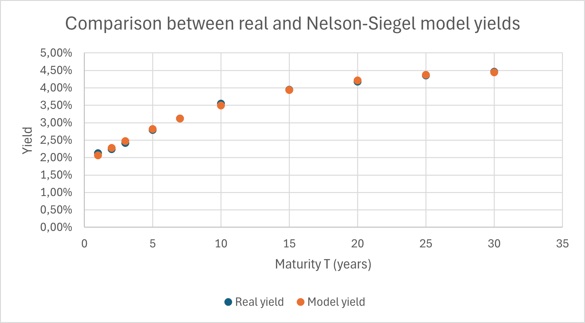
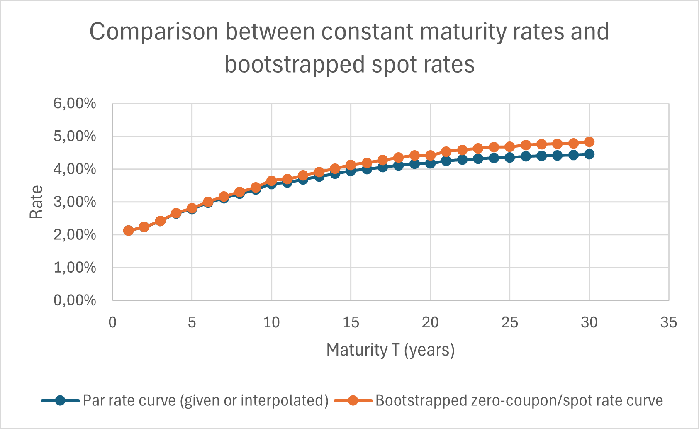
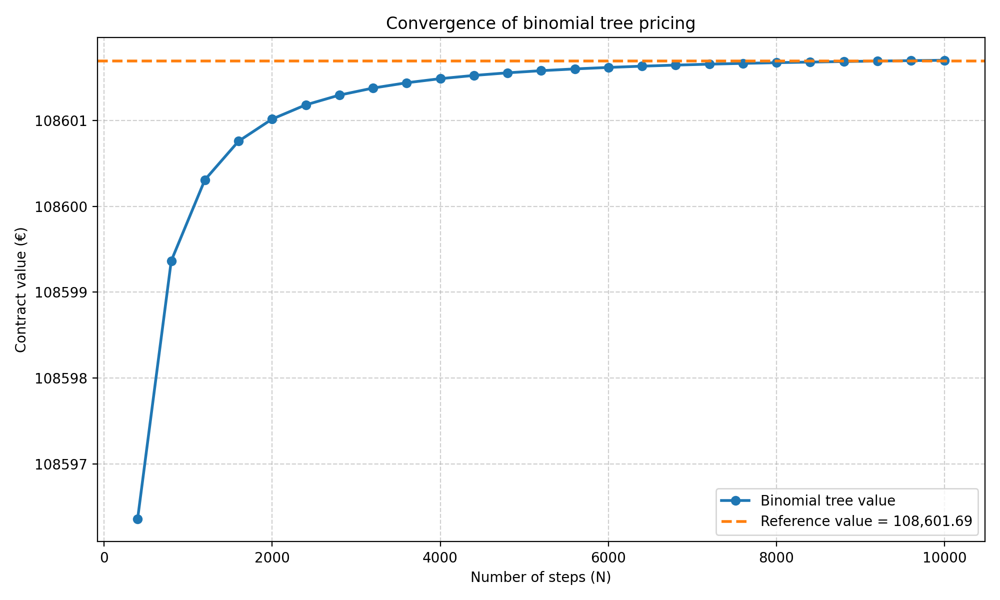
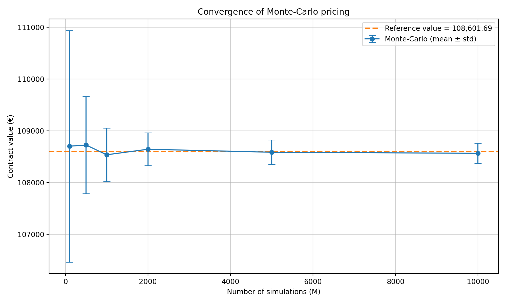

# Financial Valuation of Actuarial Liabilities (LACTU2170)

Market-consistent valuation of insurance liabilities and guaranteed products, combining **yield-curve modelling**, **interest-rate risk measures** and **derivative-based pricing** (analytical, binomial tree, Monte-Carlo).

> University project — *LACTU2170 Financial valuation of actuarial liabilities*, École polytechnique de Louvain (UCLouvain), 2025–2026.

## Highlights

| | |
|---|---|
| **Part 1 – Liabilities & bonds** | Nelson-Siegel calibration, zero-coupon bootstrapping, best-estimate of a 30-year liability portfolio (**€1.641 M**), yield / modified duration / convexity, ±1 % rate-shock analysis, accrued interest and yield of a Belgian OLO. |
| **Part 2 – Participating annuity** | Fair value of a unit-linked annuity with a guaranteed minimum return (maturity + death benefit): closed-form Black-Scholes decomposition, **binomial tree** and **Monte-Carlo** cross-validated to the cent (**€108,601.69**). |

## Part 1 — Yield curve, best estimate & bonds

*Excel (financial library + Solver) as imposed by the assignment, independently replicated in Python.*

1. **Yield curve** – Nelson-Siegel (4 parameters) fitted to French par yields (Banque de France, 12/01/2026) by RMSE minimisation (RMSE ≈ 3.7 bp).
2. **Bootstrapping** of zero-coupon rates from par rates, then discounting of the forecast liability cash flows → **Best Estimate = €1,641,132.55**.
3. **Risk measures** computed from first principles: yield of liabilities **3.7636 %**, Macaulay duration **8.83 y**, modified duration **8.51**, convexity **119.0**.
4. **Parallel shock ±1 %** – duration-only vs duration + convexity vs exact revaluation:

| Method | Δy | New BE (€) | Rel. change |
|---|---|---|---|
| Modified duration | +1 % | 1,501,522 | −8.51 % |
| Duration + convexity | +1 % | 1,511,287 | −7.91 % |
| **Exact revaluation** | +1 % | **1,516,029** | **−7.62 %** |
| Modified duration | −1 % | 1,780,743 | +8.51 % |
| Duration + convexity | −1 % | 1,790,507 | +9.10 % |
| **Exact revaluation** | −1 % | **1,784,018** | **+8.71 %** |

5. **Belgian OLO 2.75 % 22/04/2039** – accrued interest (ACT/ACT) 1.974, dirty price 92.524, yield to maturity **3.660 %**.

<p align="center">
  
  
</p>

## Part 2 — Valuation of a participating annuity

**Contract.** A policyholder invests C₀ = €100,000 for T = 5 years in an index-linked annuity (σ = 12 %, r = 3.2 %, S₀ = 100). The payoff is `C₀·max(S_t/S₀, e^{g t})` with guaranteed rate g = 2.5 %, paid at maturity if the insured survives (**GMAB**) or at death if earlier (**GMDB**). Constant force of mortality μ = 2 %.

**Approach.** Mortality is independent from the market, so the contract splits into survival/death probabilities times an *option on the index*: `C₀·max(S_t/S₀, e^{gt}) = C₀·e^{gt} + (C₀/S₀)·(S_t − S₀e^{gt})⁺`, i.e. a zero-coupon guarantee plus a Black-Scholes call.

| Method | Value (€) |
|---|---|
| Closed form (BS) + numerical integration — GMAB | 98,498.80 |
| Closed form (BS) + numerical integration — GMDB | 10,102.89 |
| **Reference value (total)** | **108,601.69** |
| Binomial tree (N = 10,000) | 108,601.70 |
| Monte-Carlo (M = 10,000, 20 runs, mean ± std) | 108,565 ± 195 |

The tree converges to the reference value as N grows, and the Monte-Carlo estimator converges at the expected O(1/√M) rate.

<p align="center">
  
  
</p>

## Repository structure

```
.
├── README.md
├── requirements.txt
├── LICENSE
├── docs/
│   ├── report_part1_yield_curve_and_bonds.pdf       # full report, Part 1
│   └── report_part2_participating_annuity.pdf       # full report, Part 2
├── part1_yield_curve_bonds/
│   ├── yield_curve_and_liabilities.xlsx             # Excel workbook (NS fit, bootstrap, BE, risk measures)
│   ├── replicate_in_python.py                       # independent Python replication
│   ├── data/liabilities_cashflows.xlsx              # forecast liability cash flows (provided dataset)
│   └── figures/
└── part2_participating_annuity/
    ├── conftest.py
    ├── src/pricing.py                               # analytical, binomial tree, Monte-Carlo
    ├── scripts/run_experiments.py                   # convergence studies + figures
    ├── tests/test_pricing.py                        # regression tests vs. report values
    └── figures/
```

## Getting started

```bash
git clone https://github.com/alexisthieltgen/actuarial-liabilities-valuation.git
cd actuarial-liabilities-valuation
pip install -r requirements.txt

# Part 1 – replicate all figures of the report
cd part1_yield_curve_bonds
python replicate_in_python.py
cd ..

# Part 2 – run convergence experiments (~30 s) and regenerate figures
cd part2_participating_annuity
python scripts/run_experiments.py
pytest
```

## Tech stack

Python (NumPy, SciPy, Matplotlib), Excel (financial functions, Solver), Black-Scholes, binomial trees, Monte-Carlo simulation.

## Author

**Alexis Thieltgen** — Applied Mathematics Engineer (UCLouvain & KTH) · [LinkedIn](https://www.linkedin.com/in/alexis-thieltgen-1b0210359/) · alexis.thieltgen@gmail.com
